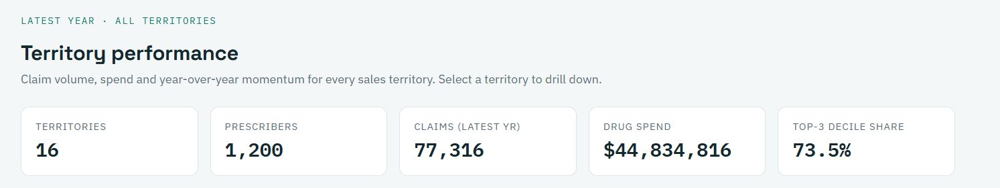
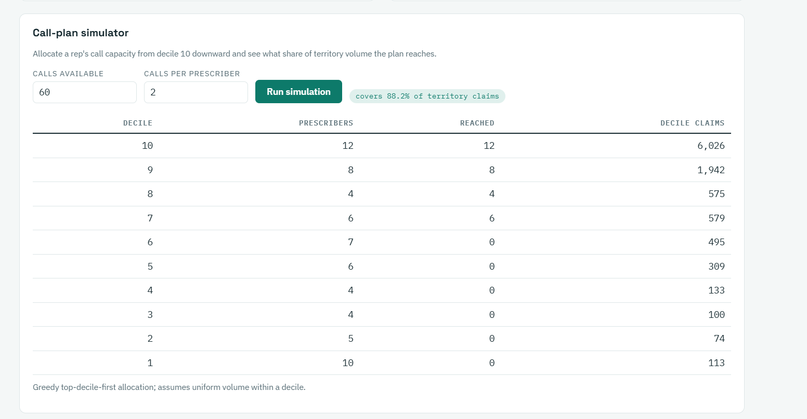
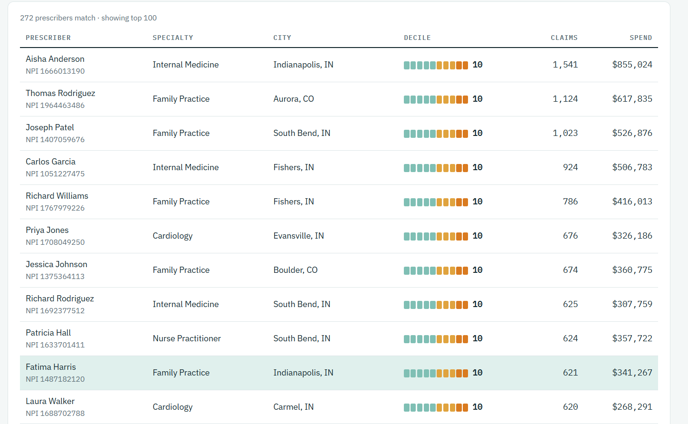

# Pharma Commercial Intelligence Platform

**Territory analytics, prescriber deciling and call-plan simulation — delivered as a working product, not a notebook.**

## The platform in action







## The business problem

Pharma sales forces are expensive, and prescription volume is heavily concentrated: in this dataset the **top 3 prescriber deciles drive ~74% of all claim volume**. A rep who spreads calls evenly wastes most of their effort on prescribers who barely prescribe. Commercial teams solve this with *deciling* — ranking prescribers 1–10 by volume and pointing rep effort at the top — and with territory-level performance tracking to see where the strategy is working.

This platform is a compact, end-to-end version of that workflow:

- **Territory performance** — claims, spend, YoY momentum and rank for every territory
- **Prescriber targeting** — every prescriber deciled nationally with `NTILE(10)`, filterable into a call list
- **Call-plan simulator** — allocate a rep's call capacity from decile 10 downward and see claim coverage (e.g. *60 calls reach ~88% of a territory's volume*)
- **Drug market view** — per-territory volume and in-class share for any brand

Everything is served by a documented REST API; the dashboard is simply the API's first customer.

## Architecture

```
CSV (CMS Part D structure)                    FastAPI
        │        etl/load_data.py       ┌──────────────────┐
        ▼                               │  /api/territories │
┌──────────────────┐                    │  /api/prescribers │──► Jinja + Chart.js
│ SQLite warehouse │ ◄── raw SQL ────── │  /api/drugs       │    dashboard
│   (star schema)  │  window functions  │  /api/insights    │
└──────────────────┘                    └──────────────────┘
```

**Star schema:** `fact_prescriptions` (npi × drug × year grain) joined to `dim_prescriber`, `dim_drug` and `dim_territory`.

**Design choices worth noting**

- Analytics live in [`app/queries.py`](app/queries.py) as raw SQL on purpose — window functions (`NTILE`, `RANK`), CTEs and conditional aggregation are the point of the project, and an ORM would bury them.
- The dashboard calls the same public `/api/...` endpoints an external client would — no private side channels.
- Deciles are computed *nationally*, then filtered by territory, which is how call plans are actually prioritized.

## Data

Ships with a **synthetic dataset modeled on the CMS Medicare Part D "Prescribers – by Provider and Drug" file** (same columns, lognormal volume distribution, specialty–drug-class affinities, CMS's <11-claims suppression rule) so the repo runs with zero downloads. Swap in the real CMS extract any time with `etl/download_real_data.py`.

**The territory structure is synthetic in both modes** — real rep alignments are not public. Prescribers are grouped by city into ~16 workload-balanced territories, mirroring standard pharma alignment practice.

## Run it

```bash
pip install -r requirements.txt
python etl/generate_sample_data.py   # build sample data (data/raw/*.csv)
python etl/load_data.py              # load SQLite warehouse
uvicorn app.main:app --reload        # http://127.0.0.1:8000
```

- Dashboard: `http://127.0.0.1:8000/`
- Interactive API docs (Swagger): `http://127.0.0.1:8000/docs`
- Tests: `pytest -q` (10 tests covering KPIs, deciling, the call-plan simulator, input validation and page rendering)

## API at a glance

| Endpoint | What it answers |
|---|---|
| `GET /api/territories` | Which territories are winning? (KPIs, YoY, rank) |
| `GET /api/territories/{id}/performance` | Why? (trend + top drugs) |
| `GET /api/prescribers?territory_id=&min_decile=` | Who should reps call? |
| `GET /api/prescribers/{npi}` | Who is this prescriber? (profile + drug mix) |
| `GET /api/drugs/{id}/market` | How is this brand doing vs its class, by territory? |
| `GET /api/insights/deciles` | How concentrated is volume? |
| `POST /api/insights/call-plan` | If a rep has N calls, what coverage do we get? |

## What I'd build next

- Multi-year decile *movement* (risers/decliners) to flag prescribers gaining momentum
- A proper alignment optimizer (balance territories on workload + opportunity, not just headcount)
- An LLM "ask the data" layer over the same API — with query citations for trust

## Stack

Python · FastAPI · SQLite (raw SQL: CTEs, window functions) · pandas ETL · Jinja2 + Chart.js · pytest

---

*Portfolio project. All prescriber names and territory assignments are synthetic; no real patient or prescriber-identifying data beyond the public CMS schema is used.*
